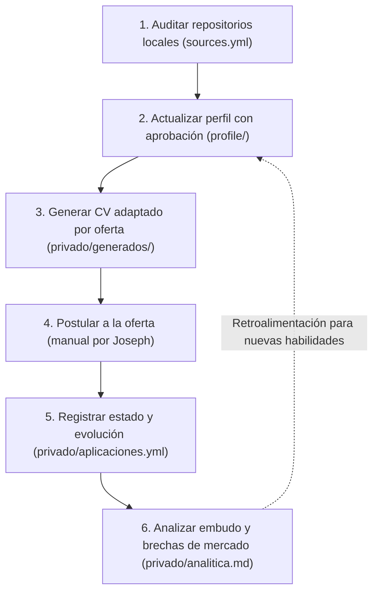

# Flujo operativo del repositorio — portfolio-joe

Este documento describe el ciclo de vida completo del sistema: desde la auditoría de repositorios de trabajo locales hasta la analítica de resultados de postulación.

---

## 1. Auditar (Inspección de evidencia local)

- **Objetivo:** Descubrir capacidades técnicas reales, arquitecturas y escala observable en los repositorios de trabajo del equipo (`/home/joeman/Documents/istpet-dev/`).
- **Precondición:** El repositorio debe estar declarado y clasificado en `profile/sources.yml`.
- **Regla de sanitización (RF-EVID-002):**
  - Para fuentes `interno` o `confidencial`, queda estrictamente prohibido incluir en artefactos públicos fragmentos de código, esquemas de bases de datos, nombres de tablas, rutas de endpoints, nombres de clientes o capturas de pantalla.
  - El agente produce un **informe de hallazgos** con métricas abstractas y propone viñetas atómicas y habilidades.
  - **Prohibición:** El agente nunca escribe directamente en `profile/`.

## 2. Actualizar (Integración de viñetas al perfil)

- **Aprobación viñeta por viñeta (RF-EVID-004):** Joseph revisa, aprueba, corrige o descarta individualmente cada viñeta propuesta.
- **Trazabilidad y atribución (RF-EVID-006):**
  - Si la fuente es `interno`, la viñeta se redacta como logro profesional dentro del puesto del ISTPET, sin nombrar ni enlazar el repositorio institucional.
  - Si la fuente es `publico`, puede enlazarse y presentarse como proyecto personal propio.
- **Flujo Git:** La incorporación se realiza en una rama de trabajo `spec/001-...` y entra a `develop` mediante Pull Request validado por `profile-lint`.

## 3. Generar (Composición y derivación ATS)

- **Entrada:** Texto o enlace de la vacante, idioma deseado (`es` | `en`) y plantilla (`ats-standard` | `ats-compact`).
- **Secuencia:**
  1. Extracción y normalización de la vacante a `privado/generados/<id>/oferta.yml`.
  2. Normalización de palabras clave contra `profile/taxonomy.yml`.
  3. Cálculo de coincidencia frente a `profile/skills.yml` y redacción de `match.md`.
  4. Selección determinista de viñetas: por mayor coincidencia de `tags`, luego por `weight` descendente, y desempate por `id` ascendente (RF-GEN-007).
  5. Composición de `cv.md` sustituyendo marcadores `{{secrets.*}}` desde `privado/.secrets`.
  6. Derivación de `cv.docx` mediante `tools/render_docx.py` y de `cv.pdf` con LibreOffice headless.

## 4. Postular (Acción externa)

- Joseph envía el documento generado (`cv.pdf` o `cv.docx`) a través del portal de empleo, correo o formulario de la empresa.
- Este paso es manual y deliberadamente externo al repositorio.

## 5. Registrar (Seguimiento de estados)

- Se registra la postulación en `privado/aplicaciones.yml` con estado inicial `borrador` y se actualiza a `postulado` tras el envío.
- **Ciclo de estados cerrado (RF-TRACK-002):**
  `borrador` → `postulado` → `screening` → `tecnica` → `final` → `oferta` → `aceptada` / `rechazada` / `sin_respuesta` / `retirada`.
- **Regla de solo anexión (RF-TRACK-003):** Cada transición añade un nuevo evento al arreglo `timeline` con su fecha. Jamás se modifican ni eliminan eventos previos.
- **Regla de silencio (PD-01):** Si transcurren 21 días desde el último evento sin recibir comunicación de la empresa, la postulación pasa al estado `sin_respuesta`.

## 6. Analizar (Métricas y retroalimentación)

- Se genera el reporte `privado/analitica.md` a partir del registro histórico.
- **Métricas:**
  - Embudo de conversión por etapas.
  - Tasa de respuesta desglosada por fuente de empleo, idioma, plantilla y rango de coincidencia.
  - Detección de brechas técnicas: lista de palabras clave demandadas por el mercado ausentes de `profile/skills.yml` (RF-ANL-003).
- **Rigor estadístico (RF-ANL-004):**
  - Con menos de 10 postulaciones registradas, el informe muestra únicamente conteos absolutos y advierte que las muestras no son concluyentes.
  - Toda tasa se expresa siempre con su numerador y denominador explícitos (`n/N`).
